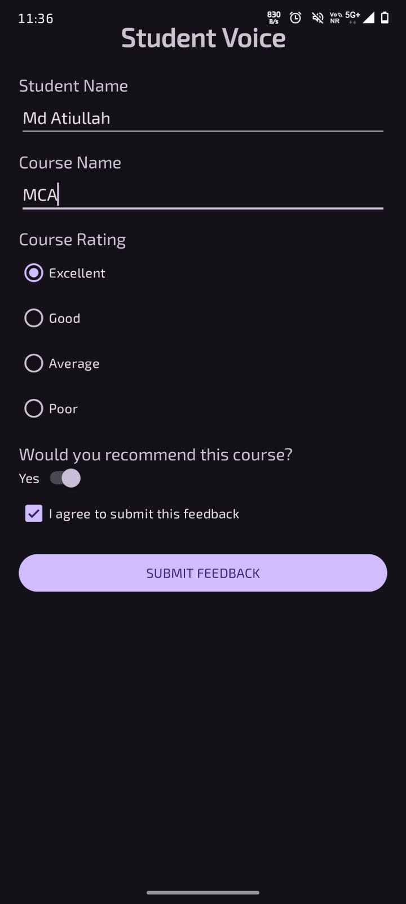
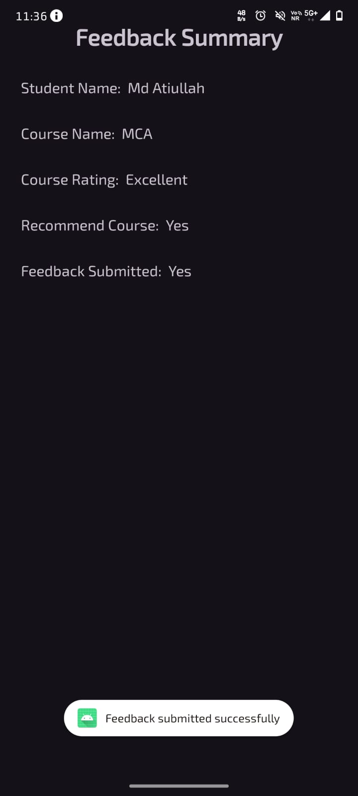

# Student Voice – Course Feedback

## 1. Experiment Title

Student Voice – Course Feedback

## 2. Aim

To develop an Android application called Student Voice to collect student feedback about a course using different Android UI components, Intent, Toast, Notification and Activity Lifecycle methods.

## 3. Scenario

A university wants to collect student feedback about its courses through an Android application called Student Voice.

The application allows students to enter their name and course name, select a course rating, choose whether they recommend the course, agree to submit the feedback, and submit the feedback.

After submission, the application navigates to the Feedback Summary screen and displays the entered information. A success Toast message and Android notification are also generated.

## 4. Technologies Used

- Android Studio
- Kotlin
- XML
- Android SDK
- Activities
- Intent
- EditText
- RadioGroup
- RadioButton
- Switch
- CheckBox
- Button
- Toast
- Android Notification
- Activity Lifecycle
- Logcat

## 5. Concepts Used

### EditText

Used to enter Student Name and Course Name.

### RadioGroup and RadioButton

Used to select one course rating:

- Excellent
- Good
- Average
- Poor

### Switch

Used to select whether the student recommends the course.

### CheckBox

Used to confirm that the student agrees to submit the feedback.

### Button

Used to submit the feedback.

### Intent

Used to transfer feedback details from MainActivity to SummaryActivity.

### Toast

Displays a success message after feedback submission.

### Notification

Generates an Android notification after successful submission.

### Activity Lifecycle

The application demonstrates:

- onCreate()
- onStart()
- onResume()
- onPause()
- onStop()
- onDestroy()

Lifecycle messages can be viewed in Android Studio Logcat.

## 6. Application Flow

```text
Start Application
       |
       v
Student Voice Screen
       |
       v
Enter Student Details
       |
       v
Select Course Rating
       |
       v
Select Recommendation
       |
       v
Accept Agreement
       |
       v
Submit Feedback
       |
       v
Feedback Summary Screen
       |
       v
Toast + Notification
```

## 7. Project Folder and File Structure

```text
StudentVoice/
│
├── app/
│   └── src/
│       └── main/
│           ├── java/
│           │   └── com/example/studentvoice/
│           │       ├── MainActivity.kt
│           │       └── SummaryActivity.kt
│           │
│           ├── res/
│           │   ├── layout/
│           │   │   ├── activity_main.xml
│           │   │   └── activity_summary.xml
│           │   └── values/
│           │
│           └── AndroidManifest.xml
│
├── gradle/
├── screenshots/
│   ├── 01_student_voice.png
│   └── 02_feedback_summary.png
│
├── .gitignore
├── build.gradle.kts
├── settings.gradle.kts
└── README.md
```

## 8. Output

### Output 1 – Student Voice Screen

The application displays the Student Voice feedback form with Student Name, Course Name, Course Rating, Recommendation Switch, Agreement CheckBox and Submit Feedback button.



### Output 2 – Feedback Summary Screen

After submitting the feedback, the application displays the Feedback Summary containing Student Name, Course Name, Course Rating, Recommendation and Feedback Submitted status.



## 9. Test Cases

### Test Case 1 – Valid Feedback

- Student Name: Ram
- Course Name: MBA
- Rating: Excellent
- Recommend: Yes
- Agreement: Yes
- Expected Result: Feedback Summary is displayed successfully.

### Test Case 2 – Different Rating

- Student Name: Ali
- Course Name: BCA
- Rating: Good
- Recommend: Yes
- Agreement: Yes
- Expected Result: Feedback Summary displays the entered details.

### Test Case 3 – USN and Name

- USN: 1JB23CS001
- Student Name: Atiullah
- Course Name: MAD
- Rating: Excellent
- Recommend: Yes
- Agreement: Yes
- Expected Result: Feedback is submitted and the summary screen is displayed.

## 10. Result

The Student Voice Android application was successfully developed and demonstrated. It collects student course feedback using Android UI components, transfers data using Intent, displays a Toast message and notification, and demonstrates Activity Lifecycle methods.
